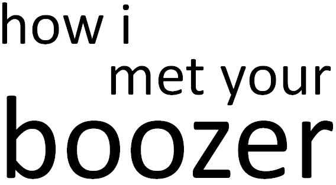

# HowIMetYourBoozer
## Le contexte

Dans la cadre d'un projet Android, nous vous proposons une application qui référence les alcools.

Animé par quatre acteurs, HowIMetYourBoozer changera votre conception des consommateurs de boissons alcoolisées.

Pour voir l'intégralité du projet, rendez-vous sur notre [Google Drive](https://drive.google.com/drive/folders/1sSUOrreBSluDfVOcAJeBtNWFBYQJgEyu?usp=sharing).

---

## L'application

Elle se base sur l'api proposé par [brewerydb](https://www.brewerydb.com/). L'application comporte des fonctionnalités :

* Rechercher une boisson parmi plus de 1100 référencées
* Consulter une boisson avec son descriptif, sa note générale ainsi que ses caractéristiques
* Ajouter un descriptif personnel
* Ajouter une note personnel
* Ajouter une boisson à vos " j'aime "

## Utiliser l'application
Pour utiliser l'application, branchez le câble depuis votre ordinateur jusqu'à votre téléphone puis exécutez le programme. Celà va créer simplement l'application sur votre téléphone et vous le garderez.

## L'avenir du projet
Pour la suite du projet, nous souhaiterions vous ajouter de nouvelles fonctionnalités tel que :

* __Ajouter un album photo.__ Vous pourrez remplir à votre guise votre album avec des photos de vous sirotant vos meilleurs bières !

* __Partager une boisson.__ Partager vos dernières dégustations à vos amis pour faire connaître vos préférées !

* __Partager un profil.__ Partager votre profil ou celui de quelqu'un qui a les mêmes goûts que vous pour vous laissez tenter vers de nouveaux goûts !

* __Ajouter la localisation.__ Dites où vous avez bu votre verre pour que ceux qui désirent, puissent la retrouver. Ou pourquoi pas pour se donner rendez-vous et faire de nouvelles rencontres !

* __Ajouter une nouvelle boisson.__ Vous venez de découvrir une boisson qui n'était pas dans l'application ? Ajoutez la ! Vous pourrez aussi y ajouter vos propres concoctions !

# Crédits
Ce projet vous est présenté par :
* Alexandre Ansel
* Carmelo Canta
* Léo Dehondt
* Adam Reyes